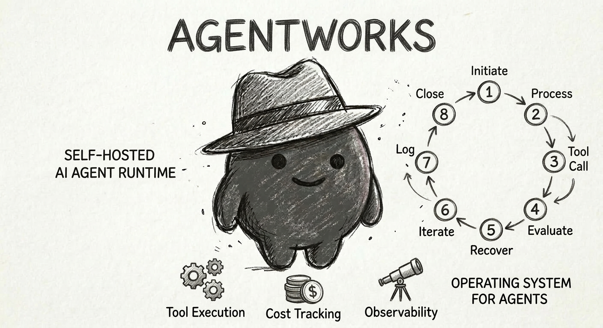
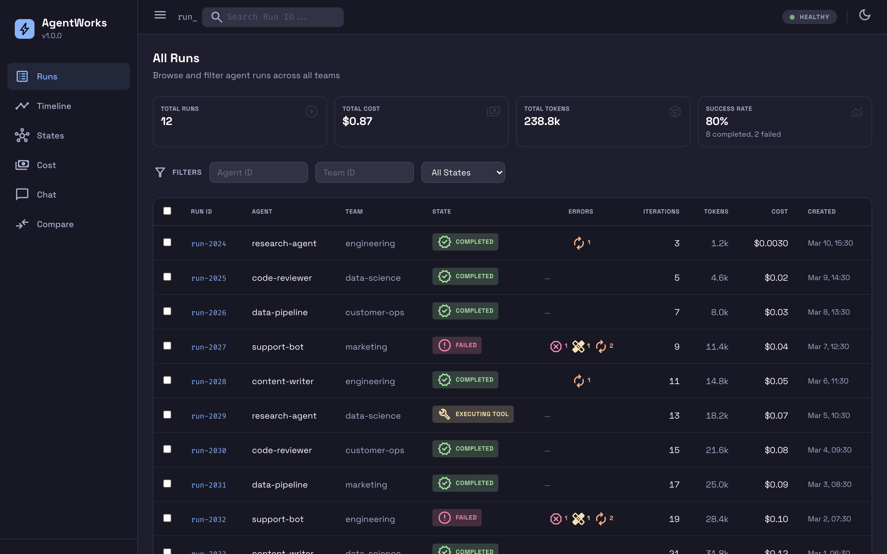
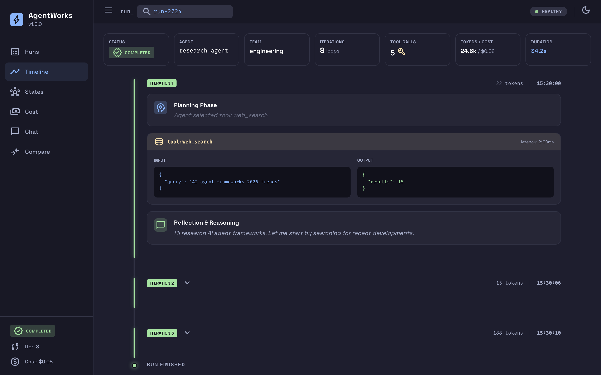
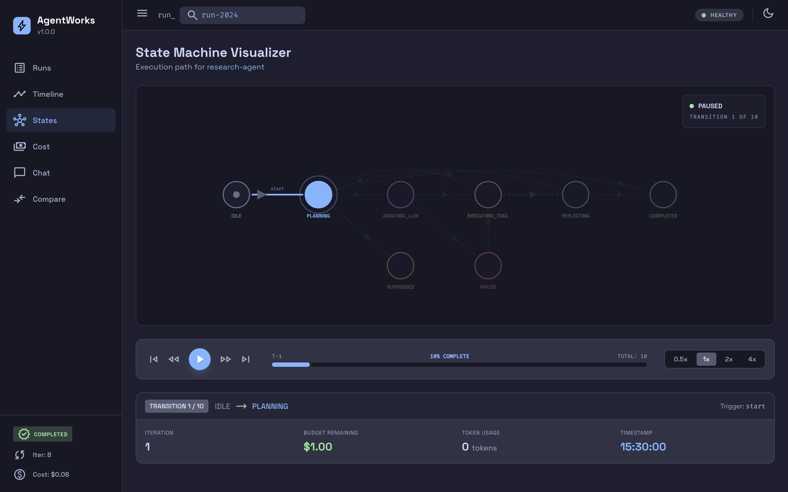
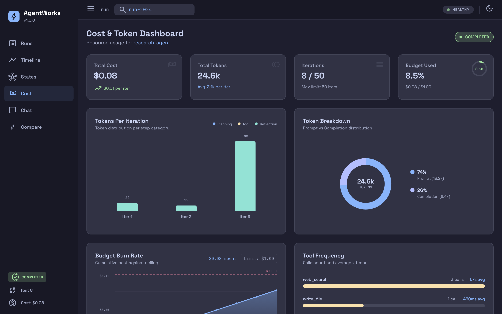
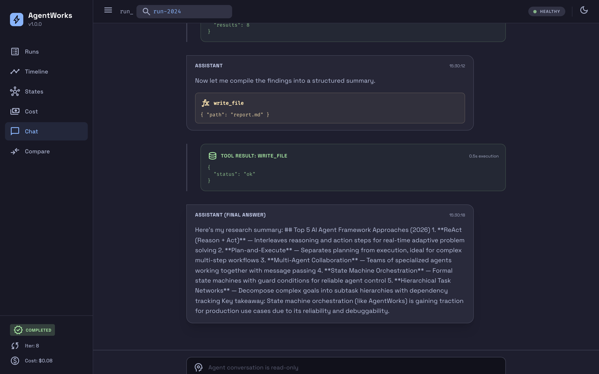
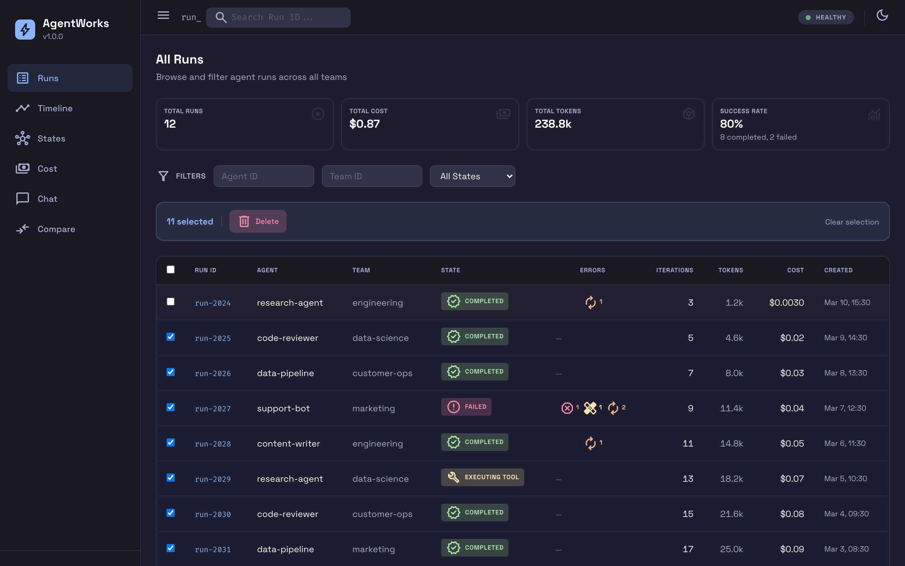

<p align="center">
  
</p>

# AgentWorks

**Your AI agents deserve infrastructure, not duct tape.**

[](https://github.com/weelzo/AgentWorks/actions/workflows/ci.yml)
[](LICENSE)
[](https://www.python.org/downloads/)
[](CHANGELOG.md)

Most teams start with a quick LLM wrapper. Then they need retries. Then tool calls. Then cost tracking. Then five teams have five wrappers, nobody knows what anything costs, and a single API outage takes down everything.

AgentWorks replaces that chaos with a single, self-hosted runtime — a state machine that orchestrates your agents through explicit, observable, recoverable states. No LangChain, no vendor lock-in, no mystery.

---

## Why AgentWorks

Most agent frameworks handle the happy path. AgentWorks handles **everything else** — the tool that times out, the LLM that hallucinates invalid JSON, the runaway agent burning $50 in tokens, the 3 AM crash with no way to resume.

### What breaks in production (and how we fix it)

| What Goes Wrong | What Most Teams Do | What AgentWorks Does |
|---|---|---|
| Tool call fails | Crash the run or retry blindly | **3-tier error classification** — retryable errors auto-retry with backoff, recoverable errors get fed back to the LLM with hints for self-correction, fatal errors fail immediately |
| Agent gets stuck in a loop | Hope `max_retries` saves you | **8-state machine with guard conditions** — transitions are validated, iteration limits enforced with graceful degradation (agent gets one final call to summarize) |
| Process crashes mid-run | Start over from scratch | **Dual-store checkpointing** — every state transition checkpointed to Redis; completed runs promoted to PostgreSQL. Resume from last checkpoint after crash |
| Agent burns through budget | Find out on the invoice | **Mid-run budget enforcement** — checked before every LLM call. Suspends (not kills) the run so you can increase budget and resume |
| LLM provider goes down | 500 errors until it's back | **Circuit breaker per provider** — auto-detects failures, routes to fallback provider, probes for recovery |
| Tool endpoint is internal | SSRF vulnerability | **Network-level SSRF protection** — blocks private IPs/localhost by default, configurable per tool |
| No idea what anything costs | Spreadsheet guesswork | **tiktoken-accurate cost tracking** — per-run, per-team, per-model attribution with OpenTelemetry metrics |
| Can't debug agent decisions | Read raw JSON logs | **6-view observability dashboard** — all runs, timeline, state machine visualizer, cost charts, conversation thread, run comparison |

---

## Features In Depth

### Three-Tier Error Classification

This is what turns an 85% success rate into 99%+. Instead of treating errors as binary (retry or fail), AgentWorks classifies every error into three tiers with completely different recovery strategies:

```
┌─────────────────────────────────────────────────────────────────────┐
│                                                                     │
│  TIER 1 — RETRYABLE           Transient failures                    │
│  Timeouts, 429s, 503s,        → Auto-retry with exponential backoff │
│  connection resets             → Agent never sees these errors       │
│                                → Configurable per tool (strategy,    │
│                                  max retries, backoff cap)           │
│                                                                     │
│  TIER 2 — RECOVERABLE         Agent mistakes                        │
│  Invalid input, schema         → Fed back to LLM with recovery      │
│  mismatch, wrong tool            hints for self-correction           │
│                                → "The input you provided to tool X   │
│                                  was invalid. Review the schema..."  │
│                                                                     │
│  TIER 3 — FATAL               Unrecoverable                         │
│  Auth failures, budget         → Immediate run failure               │
│  exceeded, safety violations   → Never retried, never sent to LLM   │
│                                                                     │
└─────────────────────────────────────────────────────────────────────┘
```

**The key insight:** errors default to **recoverable** (Tier 2), not fatal. When the LLM calls a tool with bad input, it gets a contextual hint and a chance to fix itself — just like a human developer reading an error message.

### Eight-State Machine with Guards

Every agent run follows a deterministic state machine — no implicit states, no "it's somewhere in the middleware."

```
     IDLE ──start──▸ PLANNING ──needs_tool──▸ EXECUTING_TOOL
                       │  ▴                        │
                       │  │                   tool_done
              awaiting │  │ llm_responded          │
                 _llm  │  │                        ▾
                       ▾  │    continue       REFLECTING
                    AWAITING_LLM               │  ▴  │
                                               │  │  │
                         ┌─────────────────────┘  │  │
                         │  (back to PLANNING) ───┘  │
                         │                           │
                    goal_met / budget_exceeded / fatal_error
                         │
              ┌──────────┼──────────┐
              ▾          ▾          ▾
         COMPLETED   SUSPENDED    FAILED
                         │
                    (not terminal —
                     resume after
                     budget increase
                     or approval)
```

**18 registered transitions** with named guards:
- `check_iteration_limit` — blocks new tool calls when limit reached, but allows one final LLM call to produce a summary
- `check_budget` — suspends (not kills) the run when budget exceeded
- Custom guards can be added for domain-specific rules

**Performance:** 0.3ms per transition with full audit trail.

### Dual-Store Checkpointing

```
Active runs:     Redis (hot)     ~0.8ms reads    TTL auto-cleanup (24h)
                    │
                    │ on COMPLETED/FAILED
                    ▾
Completed runs:  PostgreSQL (cold)  permanent     queryable, auditable
```

- **Every state transition** triggers a checkpoint to Redis
- **Terminal states** promote to PostgreSQL asynchronously (write-to-cold-before-delete-from-hot = zero data loss)
- **Crash recovery:** `POST /api/v1/runs/{run_id}/resume` restores from last checkpoint
- **Suspended runs:** resume after budget increase or manual approval

### Multi-Provider LLM Gateway

Not just "call OpenAI" — a production routing layer with failure isolation:

| Feature | Details |
|---|---|
| **Providers** | OpenAI, Anthropic, Azure OpenAI, any OpenAI-compatible endpoint |
| **Circuit breaker** | Per-provider, three-state (CLOSED → OPEN → HALF_OPEN), sliding-window error rate |
| **Routing** | Capability-based (`chat`, `function_calling`, `vision`, `json_mode`) with priority fallback |
| **Caching** | Exact-match response cache (5m TTL), skipped when tools present |
| **Adapters** | Provider-specific message formatting — handles Anthropic's system-message extraction, Azure's api-version, etc. |

### Self-Service Tool Registry

Teams register tools; the platform handles execution, validation, rate limiting, and health monitoring:

| Capability | How It Works |
|---|---|
| **JSON Schema validation** | Validated at registration (Draft 7), at runtime (input), and on output (non-blocking warning) |
| **Per-tool rate limiting** | Token-bucket algorithm with configurable burst size |
| **Retry policies** | Per-tool: fixed, exponential, or linear backoff with max cap |
| **Health checks** | Configurable endpoint, interval, unhealthy/healthy thresholds, auto-mark/auto-recover |
| **Tool status lifecycle** | `ACTIVE` → `DEPRECATED` → `DISABLED` / `UNHEALTHY` (auto-detected) |
| **SSRF protection** | Blocks `localhost`, `127.*`, `10.*`, `172.16-31.*`, `192.168.*`, `169.254.*`, `::1` by default |
| **Versioning** | Semantic versioning, no downgrades, schema hash tracking |

### Token-Aware Memory Management

```
Context budget: 128,000 tokens
┌──────────────────────────────────────────────────────┐
│ System prompt                              (always)  │
│ Long-term memories (vector recall)   (up to 20%)     │
│ Original user message                      (always)  │
│ Recent conversation (sliding window) (fills rest)    │
└──────────────────────────────────────────────────────┘
```

- **Short-term:** Sliding window with FIFO eviction — always preserves system prompt + first user message
- **Long-term:** Embedding-based vector recall (pgvector), scoped by agent/team/run
- **Token counting:** `tiktoken` for exact counts (not char÷4 estimates, which are 15-30% off)
- **Why not summarization:** Summaries cost $0.01-0.05 per call + 1-3s latency. Embeddings: ~20ms, no information loss.

### OpenTelemetry Observability

Not bolted on — wired into the state machine's side-effect system with zero changes to engine code:

| Signal | What Gets Emitted |
|---|---|
| **Traces** | Root span `agent.run` with children: `agent.plan`, `agent.llm.call`, `agent.tool.execute`, `agent.reflect` |
| **Metrics** | Counters (runs, tool calls, errors by tier), histograms (duration, latency), gauges (active runs) |
| **Logs** | Structured JSON with trace context injection (`trace_id`, `span_id`), run/agent/team IDs |
| **Cost attribution** | Every LLM call emits cost metric with `team_id`/`model_id` labels — build Grafana dashboards without a billing system |

### Parallel Tool Execution

When modern LLMs (GPT-4o, Claude) return multiple tool calls in a single response, AgentWorks handles them correctly:
- Builds a queue of pending + remaining tool calls
- Executes each with full error classification and retry logic
- Records every result as a separate tool message
- Adds all results to conversation before the next reflection phase

This satisfies the OpenAI requirement that every `tool_call_id` has a corresponding result message.

---

## Architecture

```
                ┌─────────────────────────────────────┐
                │         FastAPI + Middleware         │
                │   (Auth, CORS, Rate Limit, SSRF)    │
                └──────────────┬──────────────────────┘
                               │
                ┌──────────────▼──────────────────────┐
                │         Execution Engine             │
                │  (orchestrates runs through states)  │
                └──┬──────────┬──────────┬────────────┘
                   │          │          │
      ┌────────────▼┐  ┌─────▼─────┐  ┌─▼────────────┐
      │ State Machine│  │LLM Gateway│  │Tool Registry  │
      │ 8 states,    │  │ OpenAI,   │  │ rate limiting,│
      │ 18 transitions│ │ Anthropic,│  │ SSRF protect, │
      │              │  │ Azure     │  │ JSON Schema   │
      └──────────────┘  └───────────┘  └──────────────┘
                   │
      ┌────────────▼──────────────────────────────────┐
      │            Checkpoint Manager                  │
      │      Redis (hot) ←→ PostgreSQL (cold)          │
      └───────────────────────────────────────────────┘
                   │
      ┌────────────▼──────────────────────────────────┐
      │         Observability Dashboard                │
      │   Timeline · State Machine · Cost · Chat · Diff│
      └───────────────────────────────────────────────┘
```

## Quick Start

### Option 1: Local Development

```bash
git clone https://github.com/your-org/agentworks.git && cd agentworks
uv sync --all-extras
uv run pytest tests/ -v          # 389 tests, <1s
```

Start with local Redis and PostgreSQL:

```bash
# Configure
cp config/local-dev.example.yaml config/local-dev.yaml
# Edit config/local-dev.yaml — set your OpenAI API key

# Start the runtime
AGENTWORKS_CONFIG_PATH=config/local-dev.yaml uv run uvicorn agentworks.api:app --host 0.0.0.0 --port 8000

# Start the dashboard (separate terminal)
cd dashboard && npm install && npm run dev
```

Run the [customer support example](examples/customer-support-agent/) to see a full agent workflow with 3 tool calls and a live dashboard.

### Option 2: Docker Compose

```bash
cp .env.example .env             # Set passwords and API keys
docker compose up -d
```

The dashboard is served at `http://localhost:8000/dashboard/` in the Docker build.

### Option 3: Production Deployment

```bash
docker build -t agentworks:latest .
```

The multi-stage Dockerfile produces a minimal image (~120MB):
- Stage 0: Builds the dashboard SPA (Node.js)
- Stage 1: Installs Python dependencies (uv)
- Stage 2: Runtime image (non-root user, health check)

```bash
docker run -d \
  -p 8000:8000 \
  -e AGENTWORKS_CONFIG_PATH=/app/config/runtime.yaml \
  -v ./config:/app/config:ro \
  --env-file .env \
  agentworks:latest
```

---

## Start a Run

### 1. Register a tool

Tools are HTTP endpoints you already own. Register them once and every agent can use them.

```bash
curl -X POST http://localhost:8000/api/v1/tools \
  -H "Content-Type: application/json" \
  -d '{
    "tool_id": "web_search",
    "name": "Web Search",
    "description": "Search the web for information",
    "version": "1.0.0",
    "endpoint_url": "https://your-search-service.internal/api/search",
    "input_schema": {
      "type": "object",
      "properties": { "query": { "type": "string" } },
      "required": ["query"]
    },
    "owner_team": "engineering"
  }'
```

All registered tools are automatically available to every run. The LLM decides which tools to call based on the task.

### 2. Start a run

Save the request as a JSON file to avoid shell escaping issues:

```json
{
  "message": "Research the top 3 competitors to Notion and summarize their pricing.",
  "agent_id": "research-agent",
  "team_id": "product",
  "project_id": "competitor-analysis",
  "system_prompt": "You are a market research analyst. Use the available tools to gather data, then provide a concise summary with key findings.",
  "max_iterations": 10,
  "max_budget_usd": 0.50,
  "tool_ids": ["web_search"],
  "metadata": { "requested_by": "pm-team", "priority": "high" }
}
```

| Parameter | Required | Description |
|-----------|----------|-------------|
| `message` | yes | The task for the agent |
| `agent_id` | yes | Agent identifier (for attribution and filtering) |
| `team_id` | no | Team identifier for cost attribution |
| `project_id` | no | Project identifier for cost attribution |
| `system_prompt` | no | Agent persona and instructions |
| `max_iterations` | no | Override default iteration limit (1–100) |
| `max_budget_usd` | no | Override default budget ($0.01–$100) |
| `tool_ids` | no | Restrict to specific tools (default: all registered tools) |
| `metadata` | no | Opaque key-value data stored with the run |

```bash
curl -X POST http://localhost:8000/api/v1/runs \
  -H "Content-Type: application/json" \
  -d @run_request.json
```

### 3. Retrieve and list runs

```bash
# Get a specific run by ID
curl http://localhost:8000/api/v1/runs/{run_id}

# List recent runs
curl "http://localhost:8000/api/v1/runs?limit=20"
```

## Observability Dashboard

AgentWorks ships with a built-in SPA dashboard for inspecting agent runs in real time.



| View | What It Shows |
|------|--------------|
| **All Runs** | Filterable table with stats, error classification, multi-select actions (compare, delete) |
| **Run Timeline** | Vertical timeline of iterations with expandable cards for LLM reasoning, tool I/O, and timestamps |
| **State Machine** | Animated SVG diagram with playback controls — scrub through transitions, click states to inspect |
| **Cost Dashboard** | Cost waterfall per iteration, token breakdown, budget burn rate, tool frequency chart |
| **Conversation** | Chat-style thread with role-colored messages, inline tool results, raw JSON toggle |
| **Run Comparison** | Side-by-side two runs with stats deltas and divergence detection |

<details>
<summary><strong>View all dashboard screenshots</strong></summary>

### Run Timeline
Drill into each iteration — see the LLM's planning, tool calls with input/output, and reflection steps.



### State Machine Visualizer
Watch your agent traverse states in real time with animated playback controls.



### Cost & Token Dashboard
Track spend per iteration, budget burn rate, and which tools cost the most.



### Conversation Thread
Read the full agent conversation with inline tool calls and results.



### Multi-Select Actions
Select multiple runs to compare or bulk-delete.



</details>

**Development:** `cd dashboard && npm run dev` (proxies API to localhost:8000)

**Production:** Built into the Docker image, served at `/dashboard/`

**Tech stack:** React 19, TypeScript, Tailwind CSS 4, Zustand, Recharts, Vite 6

## Configuration

YAML-driven. Set `AGENTWORKS_CONFIG_PATH` to your config file.

```yaml
auth:
  enabled: true
  api_keys:
    - "env:AGENTWORKS_API_KEY"

rate_limit:
  enabled: true
  requests_per_minute: 120

providers:
  - provider_id: openai-primary
    provider_type: openai
    base_url: "https://api.openai.com/v1"
    api_key_ref: "env:OPENAI_API_KEY"
    models:
      - model_id: gpt-4o
        capabilities: ["chat", "function_calling"]
        context_window: 128000
        cost_per_1k_input: 0.0025
        cost_per_1k_output: 0.01

execution:
  max_iterations: 25
  max_budget_usd: 1.0
  default_timeout_seconds: 120

cors:
  allow_origins: ["https://your-domain.com"]
```

Secret references support two formats:
- `"env:VAR_NAME"` — reads from environment variable (recommended)
- `"sk-proj-..."` — plain string (local dev only)

## API Endpoints

| Method | Path | Description |
|--------|------|-------------|
| `POST` | `/api/v1/runs` | Start a new agent run |
| `GET` | `/api/v1/runs/{run_id}` | Get run status and execution trace |
| `GET` | `/api/v1/runs` | List runs with filtering and pagination |
| `POST` | `/api/v1/runs/{run_id}/resume` | Resume a suspended run |
| `DELETE` | `/api/v1/runs/{run_id}` | Delete a run from both stores |
| `POST` | `/api/v1/tools` | Register or update a tool |
| `GET` | `/api/v1/tools` | List registered tools |
| `GET` | `/api/v1/tools/{tool_id}` | Get tool details and stats |
| `DELETE` | `/api/v1/tools/{tool_id}` | Unregister a tool |
| `GET` | `/api/v1/health` | Deep health check (all subsystems) |
| `GET` | `/api/v1/health/live` | Liveness probe |
| `GET` | `/api/v1/health/ready` | Readiness probe |
| `GET` | `/api/v1/health/tools` | Health status of all registered tools |
| `GET` | `/api/v1/admin/providers` | List configured LLM providers |
| `GET` | `/api/v1/admin/config` | Current runtime configuration (redacted) |

## Production Checklist

- [ ] Set `auth.enabled: true` and configure API keys
- [ ] Set `rate_limit.enabled: true`
- [ ] Restrict `cors.allow_origins` to your domains
- [ ] Use `"env:VAR_NAME"` for all secrets (never plain strings)
- [ ] Set `REDIS_PASSWORD` and `POSTGRES_PASSWORD` in environment
- [ ] Configure `execution.max_budget_usd` per your cost tolerance
- [ ] Enable `observability.tracing_enabled` and point to your OTLP collector
- [ ] Run behind a reverse proxy (nginx/Caddy) with TLS
- [ ] Set resource limits on the container (CPU/memory)

## Design Principles

1. **Default to recoverable** — errors are opportunities for self-correction, not crashes. The LLM gets a hint and a second chance before anything fails.
2. **Explicit over implicit** — every state, transition, and guard is named and traceable. No hidden middleware, no magic retry loops.
3. **Suspend, don't kill** — budget exceeded? Iteration limit? The run suspends and waits. Increase the budget, approve the continuation, resume from checkpoint.
4. **Observable by default** — OpenTelemetry traces, metrics, and structured logs are wired into the state machine, not bolted on after the fact.
5. **No frameworks** — built from first principles. No LangChain, no LlamaIndex, no vendor SDK abstractions. You can read every line of code and understand exactly what happens.
6. **Self-service** — product teams register tools and start runs; the platform team owns the runtime, the budget, and the guardrails.

For the full design story — including the alternatives we evaluated and why we rejected them — see the [architecture document](ARCHITECTURE.md).

## Examples

Three progressively complex examples that demonstrate the 3-tier error system in action:

| Example | Scenario | Errors | Final State | What You Learn |
|---------|----------|--------|-------------|----------------|
| [**Customer Support Agent**](examples/customer-support-agent/) | Resolve a billing dispute — CRM lookup, billing history, refund ticket | None (happy path) | `completed` | Basic agent flow, parallel tool calls, dashboard walkthrough |
| [**E-Commerce Order Fulfillment**](examples/ecommerce-fulfillment/) | Fulfill an order — inventory check, payment processing, shipping label | 1 retryable (payment 503) + 1 recoverable (missing field) | `completed` | Auto-retry with backoff, LLM self-correction with recovery hints |
| [**Inventory Restock**](examples/inventory-restock/) | Emergency restock — check stock levels, place supplier order, notify warehouse | 1 fatal (expired API key) | `failed` | Unrecoverable errors, immediate termination, partial execution trace |

Each includes a mock server, tool definitions, and a run request — just `curl` and watch.

## Development

```bash
git clone https://github.com/your-org/agentworks.git && cd agentworks
uv sync --all-extras
uv run pytest tests/ -v           # Run tests
uv run ruff check src/ tests/     # Lint
uv run mypy src/                  # Type check
```

See [CONTRIBUTING.md](CONTRIBUTING.md) for full development setup and PR guidelines.

## License

[MIT](LICENSE) © 2026 AgentWorks Contributors
